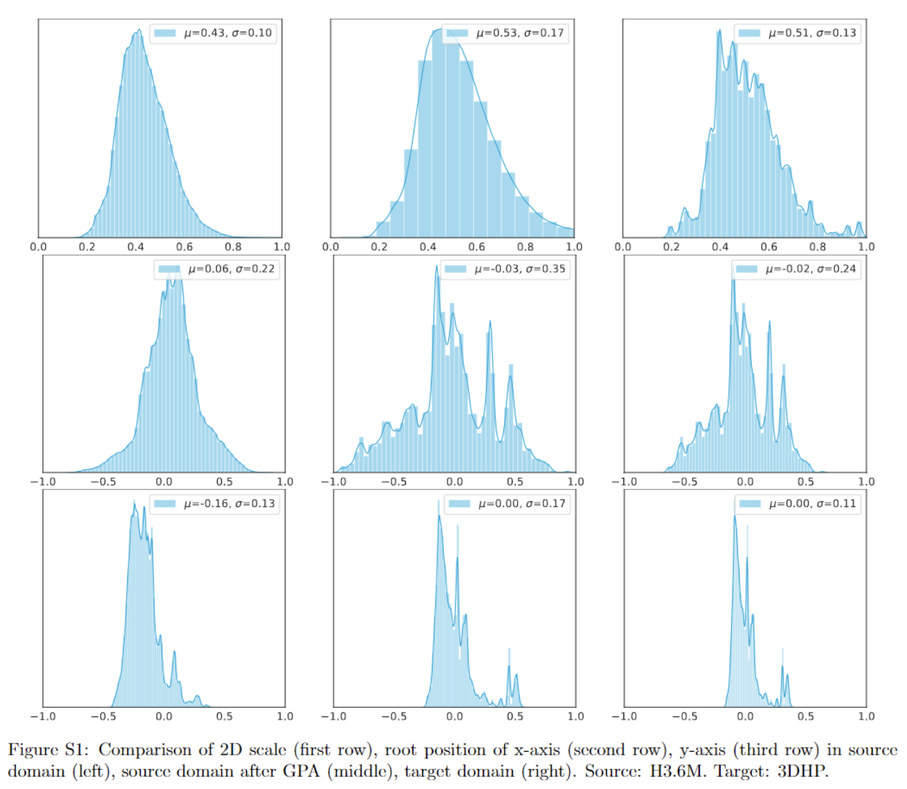

# PoseDA
[](https://arxiv.org/abs/2303.16456)

> Global Adaptation meets Local Generalization: Unsupervised Domain Adaptation for 3D Human Pose Estimation  
> [Wenhao Chai](https://rese1f.github.io/), [Zhongyu Jiang](https://zhyjiang.github.io/), Jenq-Neng Hwang, Gaoang Wang  
> ICCV 2023

Here I provide the **core code** for the proposed method, which can be easily merged into any existing code framework.

## Global Position Alignment
Global position alignment is designed to eliminate the domain gap in viewpoints, which is simple yet efficient. After that, the scale and location distributions of the 2D poses of the source dataset can be migrated to distributions of target dataset.

```python
def gpa(source_3d, target_2d, camera_params):
    """
    source_3d [N x J x 3]
        3D poses in source domain in meter
    target_2d [N x J x 2]
        2D poses in target domain after screen normalization (-1, 1)
    camera_params [N x 4]
        in order cx, cy, fx, fy
        processed by (fx, cx) = (fx, cx) * 2 / w
                     (fy, cy) = (fy, cy) * 2 / h
        i.e. in 3DHP fx, fy ~= 1.5; cx, cy ~= 0
    """
    assert source_3d.shape[:2] == target_2d.shape[:2], "poses should have same size"

    # create pairs randomly
    index = torch.randperm(target_2d.shape[0])
    target_2d = target_2d[index]
    
    # calculate 2d box
    w = torch.max(target_2d[..., 0], dim=-1)[0] - torch.min(target_2d[..., 0], dim=-1)[0]
    h = torch.max(target_2d[..., 1], dim=-1)[0] - torch.min(target_2d[..., 1], dim=-1)[0]
    s = (w + h) / 2
    
    # calculate 3d box
    dx = torch.max(source_3d[..., 0], dim=-1)[0] - torch.min(source_3d[..., 0], dim=-1)[0]
    dy = torch.max(source_3d[..., 1], dim=-1)[0] - torch.min(source_3d[..., 1], dim=-1)[0]
    
    # calculate z
    fx, fy = camera_params[0, :2]
    z = (fx * dx + fy * dy) / (2 * s)
    
    # process with camera params
    target_2d[..., 0, :] -= camera_params[..., 2:4] # c
    target_2d[..., 0, :] /= camera_params[..., :2] # f

    u, v = target_2d[..., 0, 0], target_2d[..., 0, 1]

    # calculate x, y
    x, y = z * u, z * v
    x, y, z = x.reshape(-1, 1), y.reshape(-1, 1), z.reshape(-1, 1)
    
    # give a new position to source data
    position = torch.stack([x, y, z], dim=1).reshape(-1, 1, 3)
    source_3d = source_3d - source_3d[:, :1, :] + position
    
    return source_3d
```

## Results

[](https://paperswithcode.com/sota/cross-domain-3d-human-pose-estimation-on-3dpw?p=global-adaptation-meets-local-generalization)\
[](https://paperswithcode.com/sota/cross-domain-3d-human-pose-estimation-on-mpi?p=global-adaptation-meets-local-generalization)\
[](https://paperswithcode.com/sota/3d-human-pose-estimation-in-limited-data-on?p=global-adaptation-meets-local-generalization)

We show performance boosting in various backbone (mlp, conv, gcn). Source domain: Human3.6M, target domain: MPI-INF-3DHP.

| Method | MPJPE ($\downarrow$)  | PCK ($\uparrow$) | AUC ($\uparrow$) |
|-|-|-|-|
|SemGCN [1] | 95.96 | 80.68 | 48.48 |
|+ GPA | 86.56 (-9.4) | 83.85 (+3.2) | 50.98 (+2.5) |
|SimpleBaseline [2] | 81.23 | 85.85  | 53.95|
|+ GPA | 69.19 (-12.0) | 89.90 (+4.1) | 58.50 (+4.6) |
|ST-GCN [3] | 81.19 | 85.92 | 53.78 |
|+ GPA | 74.41 (-6.8) | 88.58 (+2.7) | 55.52 (+1.7) |
|VideoPose3D [4] | 82.55 | 85.71 | 53.35 |
|+ GPA | 66.07 (-16.5) | 90.87 (+5.2) | 60.07 (+6.7) |

The distribution visualization before and after GPA.



## Citation
If our work is useful for your research, please consider citing:

```
@article{chai2023global,
  title={Global Adaptation meets Local Generalization: Unsupervised Domain Adaptation for 3D Human Pose Estimation},
  author={Chai, Wenhao and Jiang, Zhongyu and Hwang, Jenq-Neng and Wang, Gaoang},
  journal={arXiv preprint arXiv:2303.16456},
  year={2023}
}
```

## Reference
[1] Long Zhao, Xi Peng, Yu Tian, Mubbasir Kapadia, and Dimitris N Metaxas. Semantic graph convolutional networks for 3d human pose regression. In Proceedings of the IEEE/CVF conference on computer vision and pattern recognition, pages 3425–3435, 2019.

[2] Julieta Martinez, Rayat Hossain, Javier Romero, and James J Little. A simple yet effective baseline for 3d human pose estimation. In Proceedings of the IEEE international conference on computer vision, pages 2640–2649, 2017. 

[3] Yujun Cai, Liuhao Ge, Jun Liu, Jianfei Cai, Tat-Jen Cham, Junsong Yuan, and Nadia Magnenat Thalmann. Exploiting spatial-temporal relationships for 3d pose estimation via graph convolutional networks. In Proceedings of the IEEE/CVF international conference on computer vision, pages 2272–2281, 2019.

[4] Dario Pavllo, Christoph Feichtenhofer, David Grangier, and Michael Auli. 3d human pose estimation in video with temporal convolutions and semi-supervised training. In Proceedings of the IEEE/CVF Conference on Computer Vision and Pattern Recognition, pages 7753–7762, 2019.
